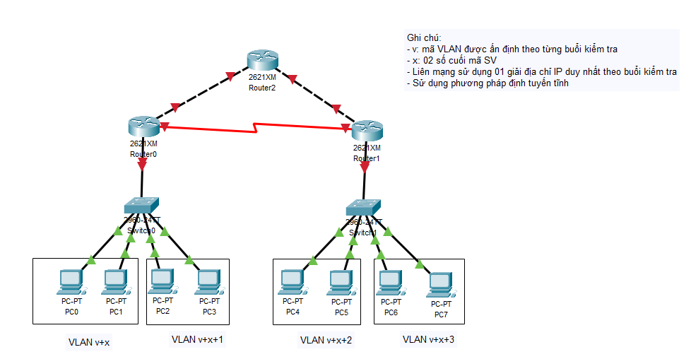
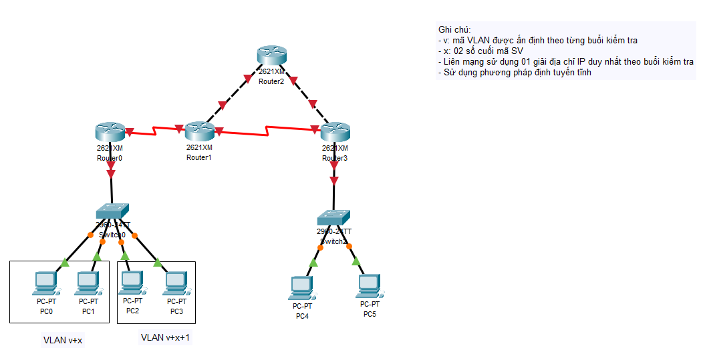
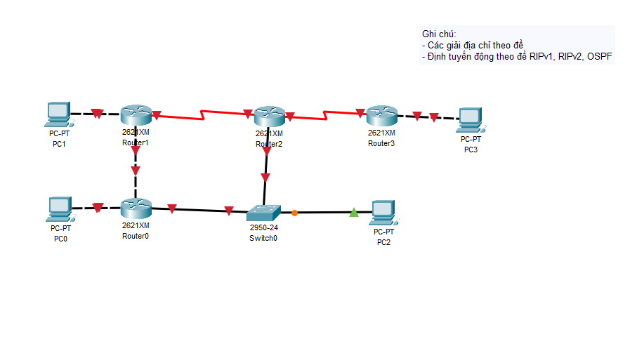
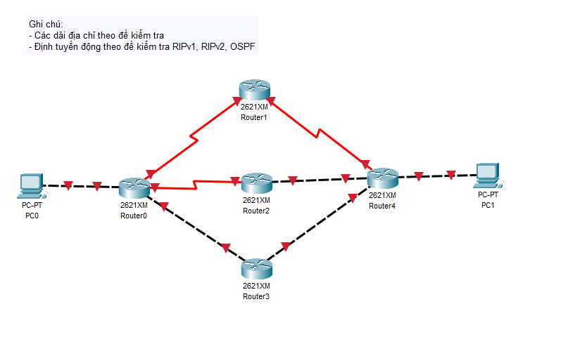
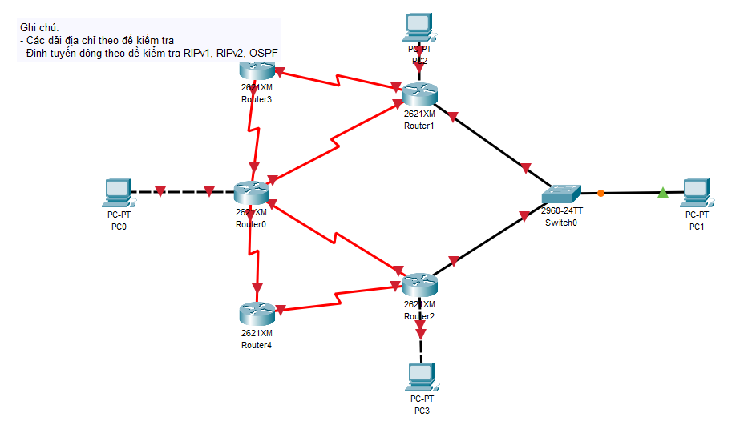

# 💻 Hướng dẫn Thực hành Mạng Máy Tính PTIT

Hướng dẫn chi tiết các bước thực hành **Mạng Máy Tính (MMT)** của thầy Long tại Học viện Công nghệ Bưu chính Viễn thông - PTIT  
**Sinh viên**: Trần Đình Hào - B22DCCN278  
**Giảng viên**: Nguyễn Đình Long | **Khóa**: D22  

(Cho tôi 1 ⭐ nếu nó hữu ích cho bạn nhé, làm cực lắm đó 😅)

---

## 📝 Giới thiệu

Chi tiết hướng dẫn 5 bài thực hành được ghi rõ trong 5 file _Tutorial.txt (TopoX.pkt → TopoX_Tutorial.txt)

---

## 🎯 Chi tiết

### [Topo 1.pkt](https://github.com/trandinhhao/PTIT-MMT-Thuc-hanh/blob/main/Topo%201.pkt)

  

- Tutorial: [Topo1_Tutorial.txt](https://github.com/trandinhhao/PTIT-MMT-Thuc-hanh/blob/main/Topo1_Tutorial.txt)

---

### [Topo 2.pkt](https://github.com/trandinhhao/PTIT-MMT-Thuc-hanh/blob/main/Topo%202.pkt)

  

- Tutorial: [Topo2_Tutorial.txt](https://github.com/trandinhhao/PTIT-MMT-Thuc-hanh/blob/main/Topo2_Tutorial.txt)

---

### [Topo 3.pkt](https://github.com/trandinhhao/PTIT-MMT-Thuc-hanh/blob/main/Topo%203.pkt)

  

- Tutorial: [Topo3_Tutorial.txt](https://github.com/trandinhhao/PTIT-MMT-Thuc-hanh/blob/main/Topo3_Tutorial.txt)

---

### [Topo 4.pkt](https://github.com/trandinhhao/PTIT-MMT-Thuc-hanh/blob/main/Topo%204.pkt)

  

- Tutorial: [Topo4_Tutorial.txt](https://github.com/trandinhhao/PTIT-MMT-Thuc-hanh/blob/main/Topo4_Tutorial.txt)

---

### [Topo 5.pkt](https://github.com/trandinhhao/PTIT-MMT-Thuc-hanh/blob/main/Topo%205.pkt)

  

- Tutorial: [Topo5_Tutorial.txt](https://github.com/trandinhhao/PTIT-MMT-Thuc-hanh/blob/main/Topo5_Tutorial.txt)
